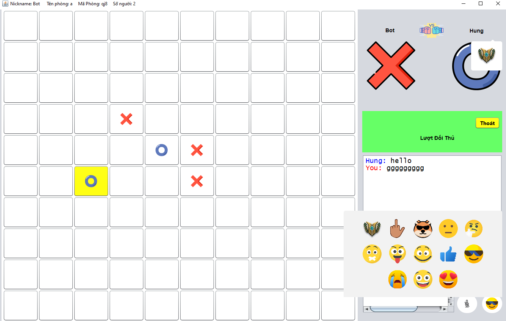

# 🎮 Caro Game (Gomoku) — Java

<p align="center">
  
</p>

> Trò chơi Caro (Gomoku) nhiều người chơi trực tuyến, được xây dựng bằng **Java Swing** với kiến trúc **Client–Server** và áp dụng Design Pattern **Observer–Observable**.

---

## 📋 Mục lục

- [Giới thiệu](#giới-thiệu)
- [Tính năng](#tính-năng)
- [Kiến trúc hệ thống](#kiến-trúc-hệ-thống)
- [Design Pattern: Observer–Observable](#design-pattern-observerobservable)
- [Công nghệ sử dụng](#công-nghệ-sử-dụng)
- [Cài đặt & Chạy](#cài-đặt--chạy)
- [Cấu trúc thư mục](#cấu-trúc-thư-mục)

---

## 🎯 Giới thiệu

**Caro Game** là ứng dụng trò chơi cờ Caro (Gomoku) hỗ trợ chơi online nhiều người. Người chơi có thể tạo phòng, tham gia phòng của người khác, nhắn tin trong phòng, gửi emoji và trò chuyện giọng nói theo thời gian thực. Ngoài ra còn có chế độ chơi với AI sử dụng thuật toán **Minimax**.

---

## ✨ Tính năng

| Tính năng | Mô tả |
|---|---|
| 🔐 Đăng nhập / Đăng ký | Xác thực người dùng qua MySQL |
| 🏠 Quản lý phòng | Tạo phòng, tham gia phòng, rời phòng |
| 🎲 Chơi nhiều người | Hai người chơi đối kháng trực tuyến qua TCP Socket |
| 🤖 Chế độ AI | Chơi với máy bằng thuật toán Minimax |
| 💬 Chat trong phòng | Nhắn tin văn bản theo thời gian thực |
| 😄 Gửi Emoji | Gửi icon/emoji vui nhộn cho đối thủ |
| 🎙️ Voice Chat | Trò chuyện giọng nói trong game |
| 🔔 Thông báo | Thông báo khi đối thủ vào/thoát phòng |
| 🎵 Âm thanh | Hiệu ứng âm thanh khi đánh, thắng, thua |
| 📏 Bàn cờ linh hoạt | Hỗ trợ kích thước bàn cờ tùy chỉnh |

---

## 🏗️ Kiến trúc hệ thống

```
┌──────────────────────────┐          TCP Socket (Port 1106)          ┌────────────────────────┐
│       CLIENT             │ ◄──────────────────────────────────────► │       SERVER           │
│                          │                                          │                        │
│  Login.java              │   ActionType protocol (text-based)       │  ServerManager.java    │
│  ListRoom.java           │   Format: actionType;ResultCode;content  │  (extends Observable)  │
│  GameMatch.java          │                                          │                        │
│  (implements Observer)   │                                          │  Interface/Server.java │
│                          │                                          │  (implements Observer) │
│  ClientManager.java      │                                          │                        │
│  (extends Observable)    │                                          │  DBConnect.java        │
└──────────────────────────┘                                          │  (MySQL)               │
                                                                      └────────────────────────┘
```

---

## 🔄 Design Pattern: Observer–Observable

Dự án áp dụng pattern **Observer–Observable** từ `java.util` để tách biệt tầng xử lý mạng khỏi tầng giao diện người dùng.

### Phía Client

```
ClientManager (Observable)
    │
    ├── addObserver(Login)        → Màn hình đăng nhập lắng nghe kết quả
    ├── addObserver(ListRoom)     → Danh sách phòng lắng nghe sự kiện
    └── addObserver(GameMatch)    → Màn hình game lắng nghe nước đi, chat, ...
```

- **`ClientManager`** extends `Observable`: Nhận dữ liệu TCP từ server, parse thành đối tượng `Result` rồi gọi `notifyObservers(result)`.
- **`GameMatch`**, **`ListRoom`**, **`Login`** đều implements `Observer` để lắng nghe và cập nhật UI tương ứng.
- Khi chuyển màn hình, `deleteObserver` và `addObserver` được gọi để chỉ màn hình hiện tại nhận sự kiện.

### Phía Server

```
ServerManager (Observable)
    │
    └── addObserver(Server UI)    → Giao diện server nhận log hoạt động
```

- **`ServerManager`** extends `Observable`: Xử lý tất cả request từ client và gửi log sự kiện tới Observer là giao diện Server.

### Luồng dữ liệu

```
[Server] Nhận request → Xử lý → Gửi Response (text)
[Client] ClientManager nhận text → Parse → Result object
         → notifyObservers(result)
         → update(Observable, Object) được gọi trên Observer hiện tại
         → UI cập nhật
```

---

## 🛠️ Công nghệ sử dụng

- **Ngôn ngữ:** Java (JDK 8+)
- **GUI:** Java Swing + MigLayout
- **Mạng:** Java TCP Socket
- **Database:** MySQL (port 3307, database `carogame`)
- **Thư viện:**
  - `gson-2.11.0.jar` — JSON serialization
  - `miglayout-4.0.jar` — Layout manager cho Swing
  - `TimingFramework-0.55.jar` — Animation framework
  - `mysql-connector-j-9.1.0.jar` — MySQL JDBC driver
  - `VoiceChat_Comm.jar` — Voice chat communication

---

## ⚙️ Cài đặt & Chạy

### Yêu cầu

- JDK 8 trở lên
- MySQL Server (port **3307**)
- Apache NetBeans (khuyến nghị, dự án dùng `build.xml`)

### 1. Cài đặt cơ sở dữ liệu

```sql
-- Import file SQL vào MySQL
source carogame.sql;
```

Cấu hình kết nối trong `Caro - Server/src/Core/DBConnect.java`:

```java
private static final String URL      = "jdbc:mysql://localhost:3307/carogame";
private static final String USER     = "root";
private static final String PASSWORD = "";
```

### 2. Chạy Server

```bash
cd "Caro - Server"
# Mở bằng NetBeans và chạy, hoặc dùng Ant:
ant run
```

Server sẽ lắng nghe tại cổng **1106**.

### 3. Chạy Client

```bash
cd "Caro - Client"
ant run
```

> Mặc định client kết nối đến `localhost:1106`. Thay đổi địa chỉ server trong `ClientManager.java` nếu cần.

---

## 📁 Cấu trúc thư mục

```
Caro/
├── Myapp.png                    # Screenshot ứng dụng
├── carogame.sql                 # Script tạo database
├── tictactoe.sql
│
├── Caro - Client/
│   └── src/
│       ├── AIGame/              # Chế độ chơi với AI (Minimax)
│       │   ├── Board.java
│       │   ├── Minimax.java
│       │   └── ...
│       ├── Core/
│       │   ├── ClientManager.java   # Observable — Quản lý kết nối TCP
│       │   ├── ActionType.java      # Hằng số loại hành động
│       │   ├── Result.java          # Model dữ liệu trả về
│       │   ├── ResultCode.java      # Mã trạng thái
│       │   └── VoiceChatClient.java # Voice chat client
│       ├── Interface/
│       │   ├── Login.java           # Observer — Màn hình đăng nhập
│       │   ├── ListRoom.java        # Observer — Danh sách phòng
│       │   └── GameMatch.java       # Observer — Màn hình chơi game
│       ├── Swing/                   # Custom Swing components
│       ├── Assets/                  # Hình ảnh, âm thanh
│       └── sweet_alert/             # Dialog thắng/thua
│
└── Caro - Server/
    └── src/
        ├── Core/
        │   ├── ServerManager.java   # Observable — Xử lý toàn bộ logic server
        │   ├── DBConnect.java       # Kết nối MySQL
        │   ├── Room.java            # Model phòng game
        │   ├── User.java            # Model người dùng
        │   ├── ActionType.java      # Hằng số loại hành động
        │   └── VoiceChatServer.java # Voice chat server
        └── Interface/
            ├── Server.java          # Observer — Giao diện quản lý server
            └── ServerGame.java
```

---

## 📡 Giao thức truyền tin

Giao tiếp giữa Client và Server sử dụng định dạng **text thuần**, phân tách bằng dấu `;`:

```
<ActionType>;<ResultCode>;<Content>
```

Ví dụ:
| Hành động | Gói tin gửi lên |
|---|---|
| Đăng nhập | `1;username;password` |
| Tạo phòng | `6;tenPhong;chuPhong;15x15` |
| Tham gia phòng | `3;maPhong` |
| Gửi nước đi | `11;X;5-7` |
| Gửi tin nhắn | `4;nội dung` |
| Đăng xuất | `10;null` |

---

<p align="center">Made with ❤️ using Java Swing</p>
